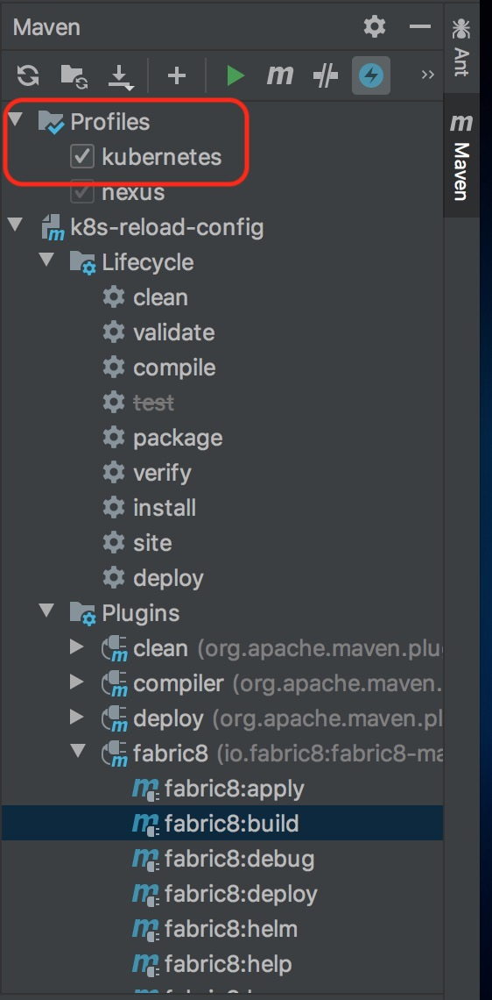

# k8s-reload-config
This example demonstrate how to use the reload feature to change the configuration of a spring-boot application at runtime in kubernetes.

The application consists of a timed bean that periodically prints a message to the console. 
The message can be changed using a config map.

* [Source](https://github.com/spring-cloud/spring-cloud-kubernetes/tree/master/spring-cloud-kubernetes-examples/kubernetes-reload-example)

### 1. Add a k8s ConfigMap: 

Create a yaml file with the following contents:

```yml
apiVersion: v1
kind: ConfigMap
metadata:
  name: reload-example
data:
  application.properties: |-
    bean.message=Hello World!
    another.property=value
```

A sample config map is provided with this example in the *config-map.yml* file.

To deploy the config map, just run the following command on Kubernetes:

``` shell script
$ alias kc="kubectl"
$ kc create -f config-map.yml
```

As soon as the config map is deployed, the output of the application changes accordingly.
The config map can be now edited with the following command:

```
$ kc edit configmap reload-example
```

Changes are applied immediately when using the *event* reload mode.

The name of the config map (*"reload-example"*) matches the name of the application as declared in the `bootstrap.yml` file.

The property name (*"bean.message"*) matches the `MyConfig.java` configuration property.

**Note**: If you are running in a Kubernetes environment where [RBAC](https://kubernetes.io/docs/reference/access-authn-authz/rbac/) is enabled, you need to make sure that your pod has the right level of authorizations to access the K8s APIs or resources.
 To help you get started, a sample `ServiceAccount` and `RoleBinding` configuration is provided in `src/k8s` directory. These configuration needs to be applied to your K8s cluster and the newly created `ServiceAccount` needs to be attached to your pod spec like this:

```yml
      spec:
        containers:
          image: <image_loc>
          imagePullPolicy: IfNotPresent
          livenessProbe:
            failureThreshold: 3
            httpGet:
              path: /actuator/health
              port: 8080
              scheme: HTTP
            initialDelaySeconds: 180
            successThreshold: 1
          name: spring-boot
          ports:
          - containerPort: 8080
            name: http
            protocol: TCP
          - containerPort: 9779
            name: prometheus
            protocol: TCP
          readinessProbe:
            failureThreshold: 3
            httpGet:
              path: /actuator/health
              port: 8080
              scheme: HTTP
            initialDelaySeconds: 10
            successThreshold: 1
          securityContext:
            privileged: false
        serviceAccountName: <service_account_name>
```

## 2. Running the example
Once you have your environment set up, you can deploy the application using the fabric8 maven plugin:

### Command line
``` shell script
$ ./mvnw clean package fabric8:build fabric8:helm -Pkubernetes -DskipTests=true

## helm configuration
$ tar -xvf target/k8s-reload-config-0.0.1-SNAPSHOT-helm.tar.gz
$ mv k8s-reload-config ./helm

## Build docker image
$ cd target/docker/avisow/k8s-reload-config/latest/build/
$ docker build -t avisow/k8s-reload-config:1.1 .

$ docker tag avisow/k8s-reload-config:1.1 localhost:32000/avisow/k8s-reload-config:1.1
$ docker push localhost:32000/avisow/k8s-reload-config:1.1
$ cd -

$ cd helm/
$ vi templates/reload-config-deployment.yaml
## Edit the docker image tag to 'localhost:32000/avisow/k8s-reload-config:1.1'

$ helm3 install reload-config .
NAME: reload-config
LAST DEPLOYED: Fri May  8 21:10:28 2020
NAMESPACE: rw-dev
STATUS: deployed
REVISION: 1
TEST SUITE: None

$ helm3 ls
NAME         	NAMESPACE	REVISION	UPDATED                             	STATUS  	CHART                           	APP VERSION
reload-config	rw-dev   	1       	2020-05-08 21:10:28.440896 -0700 PDT	deployed	k8s-reload-config-0.0.1-SNAPSHOT	           

$ kc logs -f reload-config-5fc85cb464-88hq8
$ kc edit cm/reload-config
## Change the message property

$ helm3 uninstall spring-cloud-kubernetes-example-reload
release "spring-cloud-kubernetes-example-reload" uninstalled
```

Example Output:
```shell script
$ kc create -f config-map.yml 
configmap/reload-example created
$ kc get cm
NAME             DATA   AGE
reload-example   1      6s

$ kc get pods
NAME                                   READY   STATUS    RESTARTS   AGE
spring-cloud-reload-589f97bb47-rhwvv   1/1     Running   0          10m

$ kc logs -f spring-cloud-reload-589f97bb47-rhwvv &
   
$ kc get cm
NAME             DATA   AGE
reload-example   1      8m45s

$ kc edit cm/reload-example
configmap/reload-example edited

2020-05-07 00:36:48.329 DEBUG 1 --- [   scheduling-1] o.s.cloud.kubernetes.config.ConfigUtils  : Config Map namespace has not been set, taking it from client (ns=rw-dev)
2020-05-07 00:36:48.334 DEBUG 1 --- [   scheduling-1] o.s.cloud.kubernetes.config.ConfigUtils  : Config Map namespace has not been set, taking it from client (ns=rw-dev)
2020-05-07 00:36:48.337 DEBUG 1 --- [   scheduling-1] o.s.c.k.config.ConfigMapPropertySource   : The single property with name: [application.properties] will be treated as a properties file
The first message is: Hello World!
The other message is: this is a dummy message
2020-05-07 00:36:53.340 DEBUG 1 --- [   scheduling-1] o.s.cloud.kubernetes.config.ConfigUtils  : Config Map namespace has not been set, taking it from client (ns=rw-dev)
2020-05-07 00:36:53.357 DEBUG 1 --- [   scheduling-1] o.s.cloud.kubernetes.config.ConfigUtils  : Config Map namespace has not been set, taking it from client (ns=rw-dev)
2020-05-07 00:36:53.361 DEBUG 1 --- [   scheduling-1] o.s.c.k.config.ConfigMapPropertySource   : The single property with name: [application.properties] will be treated as a properties file
2020-05-07 00:36:53.364  INFO 1 --- [   scheduling-1] k.c.r.PollingConfigurationChangeDetector : Reloading using strategy: REFRESH
2020-05-07 00:36:53.431 DEBUG 1 --- [   scheduling-1] ubernetesProfileEnvironmentPostProcessor : 'kubernetes' already in list of active profiles
2020-05-07 00:36:53.582 DEBUG 1 --- [   scheduling-1] ubernetesProfileEnvironmentPostProcessor : 'kubernetes' already in list of active profiles
2020-05-07 00:36:53.604 DEBUG 1 --- [   scheduling-1] o.s.cloud.kubernetes.config.ConfigUtils  : Config Map namespace has not been set, taking it from client (ns=rw-dev)
2020-05-07 00:36:53.663 DEBUG 1 --- [   scheduling-1] o.s.cloud.kubernetes.config.ConfigUtils  : Config Map namespace has not been set, taking it from client (ns=rw-dev)
2020-05-07 00:36:53.665 DEBUG 1 --- [   scheduling-1] o.s.c.k.config.ConfigMapPropertySource   : The single property with name: [application.properties] will be treated as a properties file
2020-05-07 00:36:53.668  INFO 1 --- [   scheduling-1] b.c.PropertySourceBootstrapConfiguration : Located property source: [BootstrapPropertySource {name='bootstrapProperties-configmap.reload-example.rw-dev'}, BootstrapPropertySource {name='bootstrapProperties-configmap.other.rw-dev'}]
2020-05-07 00:36:53.671  INFO 1 --- [   scheduling-1] o.s.boot.SpringApplication               : The following profiles are active: kubernetes
2020-05-07 00:36:53.683  INFO 1 --- [   scheduling-1] o.s.boot.SpringApplication               : Started application in 0.315 seconds (JVM running for 198.377)
The first message is: Hello Ryan!!
The other message is: this is a dummy message

```

### With Intellij:

#### 1. Make sure the `KUBECONFIG` environment variable is added to the Runner:


#### 2. Add *repackage* goal into the __spring-boot-maven-plugin__ build configuration in `pom.xml`
```xml
<executions>
    <execution>
        <goals>
            <goal>repackage</goal>
        </goals>
    </execution>
</executions>
```

This will make the jar package as a stand-alone app. Test it with:
``` shell script
$ java -jar target/k8s-reload-config-0.0.1-SNAPSHOT.jar
```

#### 3. Run maven build *'clean package fabric8:build fabric8:helm'* with *kubernetes* profile:


It will produce:


* Untar the `target/k8s-reload-config-0.0.1-SNAPSHOT-helm.tar.gz` into *helm* folder.
* Build the docker image and push it to the registry.